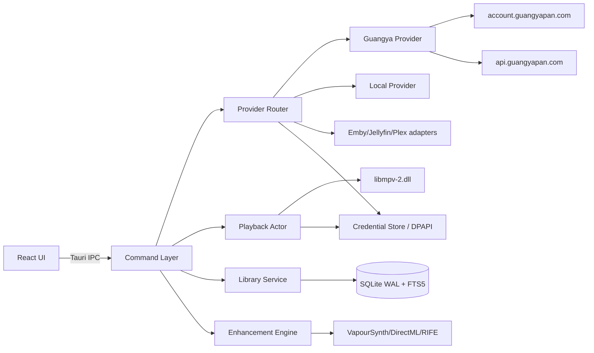
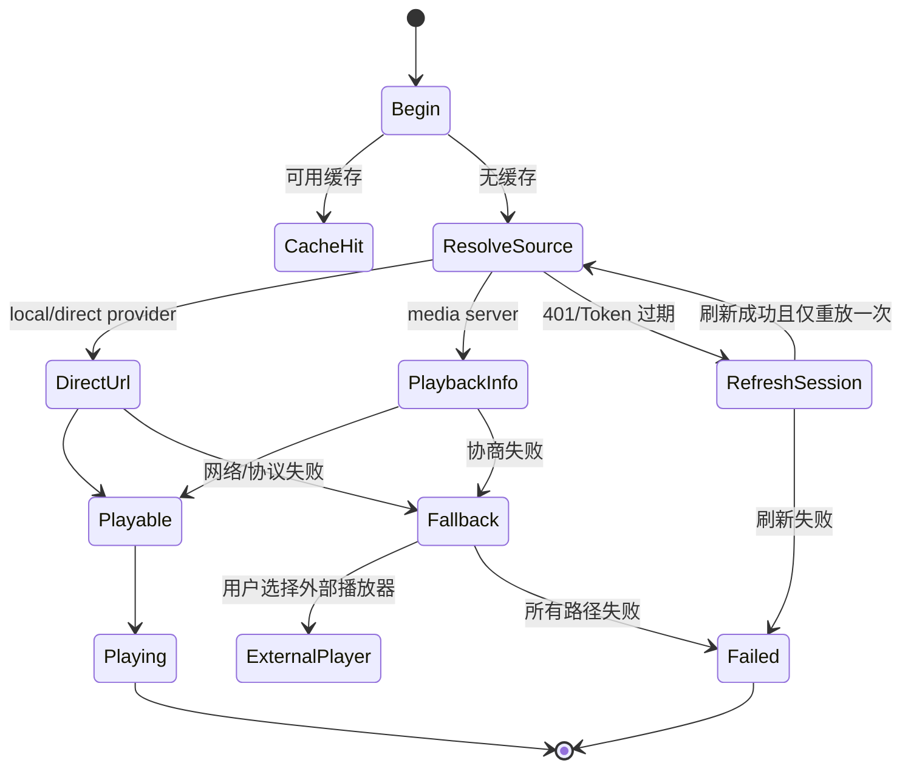

# TTV 后端开发流程与实施规范

> 本文是 TTV 第一版后端的执行手册。它把需求确认、LumiPlayer 逆向证据和现有前端/播放/Provider 规格转换为可按阶段实施的后端流程。
>
> 目标平台：Windows 11 x64。目标架构：Tauri 2 + Rust 单进程核心 + React/TypeScript 前端。TTV 不复制 LumiPlayer 的 StreamHub 或远端 `api/3` 服务。

## 1. 后端目标与边界

### 1.1 后端负责的事情

- 管理 Tauri 窗口和播放器生命周期。
- 通过 `libmpv-2.dll` 播放本地文件、HTTP、HLS 和 DASH。
- 统一 Provider 登录、目录浏览、播放地址解析、Token 刷新和错误转换。
- 管理独立 SQLite 数据库、媒体索引、播放历史、收藏和设置。
- 使用 Windows DPAPI 保护 Access Token、Refresh Token 和其他敏感凭据。
- 编排 RIFE/VapourSynth、GLSL 超分和运行时资源探测。
- 提供稳定、可版本化的 Tauri IPC 命令给 React 前端。
- 输出结构化日志、性能指标和可诊断错误。

### 1.2 后端不负责的事情

- 不引入 Java/Spring Boot/StreamHub 作为运行时依赖。
- 不硬编码 LumiPlayer 的远端 `117.72.12.20:9651/api/3`。
- 不在前端保存或拼接 Provider 私密请求。
- 不把未抓包确认的光鸭字段写成不可配置常量。
- 不实现 TTV 自有账号、订阅、License 或在线激活系统。

### 1.3 交付分层

```text
v0.1  后端基础：配置、日志、SQLite、DPAPI、Provider 接口、libmpv 本地播放
v0.2  光鸭闭环：双通道登录、目录浏览、清晰度、直链、刷新、播放
v1.0  可发布版本：媒体库、失败降级、RIFE/超分、安装包、更新回滚
```

## 2. 运行时架构



### 2.1 进程与线程模型

- Tauri 主进程负责命令注册、状态持有和生命周期管理。
- `PlaybackActor` 使用专用 OS 线程调用 libmpv；Tauri 命令只通过消息通道发送播放指令。
- 网络请求使用异步任务，禁止在 Tauri 命令线程中执行不可控的阻塞 I/O。
- SQLite 使用单一连接池或受控连接管理；写入集中提交，避免多个模块各自维护连接。
- Provider 会话放在内存状态中，落盘前必须经过凭据存储层。
- 前端只能通过 IPC 访问后端状态，不直接访问 SQLite、DPAPI 或 Provider API。

## 3. 推荐代码边界

```text
src-tauri/
├── src/
│   ├── app/              # AppState、生命周期、配置加载
│   ├── commands/         # Tauri IPC 命令，仅做参数校验和服务调用
│   ├── providers/        # MediaProvider、ProviderRouter、各适配器
│   ├── playback/         # PlaybackActor、libmpv FFI、播放状态
│   ├── library/          # 媒体、历史、收藏、扫描、FTS5
│   ├── storage/          # SQLite、迁移、事务、缓存
│   ├── security/         # DPAPI、敏感字段脱敏、凭据生命周期
│   ├── enhancement/      # GLSL、VapourSynth、RIFE、GPU 能力
│   ├── runtime/          # 资源目录、DLL、模型、版本和健康检查
│   ├── diagnostics/      # 日志、指标、错误报告、脱敏
│   └── error.rs          # 统一错误类型和 IPC 序列化
├── resources/            # 随安装包分发的运行库和模型
└── migrations/           # SQLite 版本迁移
```

边界规则：`commands` 不包含业务逻辑；`providers` 不直接写数据库；`playback` 不知道具体 Provider；`security` 不向日志输出明文凭据。

## 4. 实施流程

### 阶段 0：契约冻结与工程准备

**目标**：让后续实现有稳定接口，且不把推断当成事实。

工作项：

1. 建立 Rust workspace、React 前端和 Tauri 配置。
2. 固定 `AppState`、错误格式、日志字段和 IPC 命名规则。
3. 把现有规格中的光鸭未知字段标记为运行时配置或待验证字段。
4. 准备本地视频、HTTP、HLS、HDR、ASS 字幕和多音轨测试样本。
5. 建立 Mock Provider，先让 UI 和播放核心脱离真实账号开发。

阶段门槛：`cargo check`、TypeScript 类型检查和最小 Tauri 启动均通过。

### 阶段 1：配置、日志与运行时资源

实现顺序：

1. 解析应用目录、数据目录、缓存目录和资源目录。
2. 加载默认配置，再合并用户配置和命令行/环境覆盖项。
3. 校验 `libmpv`、FFmpeg、Shader、VapourSynth、模型的存在性和版本。
4. 启动结构化日志，默认过滤 Token、Cookie、Authorization、直链签名参数。
5. 暴露 `runtime_status`、`runtime_diagnostics` 和版本信息。

启动失败处理：

```text
资源缺失 -> 记录具体路径 -> 关闭对应能力 -> 保留基础 UI
libmpv 缺失 -> 播放能力不可用 -> 提示修复/重装
增强资源缺失 -> 关闭 RIFE/超分 -> 基础播放继续
数据库不可写 -> 进入只读模式 -> 禁止静默丢数据
```

### 阶段 2：SQLite 与凭据安全

数据库启动时执行：

```sql
PRAGMA journal_mode = WAL;
PRAGMA synchronous = NORMAL;
PRAGMA foreign_keys = ON;
PRAGMA busy_timeout = 30000;
PRAGMA temp_store = MEMORY;
```

第一版表：

| 表 | 用途 |
|---|---|
| `media` | 统一媒体条目、来源、层级和扩展 JSON |
| `media_fts` | 标题/原名全文检索 |
| `watch_history` | 播放位置、完成比例、最近播放时间 |
| `favorites` | 收藏关系 |
| `providers` | Provider 配置和账号索引，不保存明文 Token |
| `kv` | 非敏感配置和版本化状态 |
| `schema_migrations` | 数据库迁移版本 |

凭据流程：

```text
Provider 返回会话
  -> 校验字段和过期时间
  -> 序列化为内部 Session
  -> Windows DPAPI 加密
  -> Base64 后写入 SQLite
  -> 日志只记录 account_id/provider_id/过期时间
```

DPAPI 是 Windows 用户/计算机上下文保护，不能表述为“跨机器可解密”或“硬件级保证”。跨平台实现应替换为对应系统密钥存储接口。

### 阶段 3：Provider 抽象与路由

Provider 的最小能力接口：

```rust
pub trait MediaProvider: Send + Sync {
    fn id(&self) -> &'static str;
    fn capabilities(&self) -> ProviderCapabilities;
    async fn login_device_code(&self) -> Result<DeviceCode, ProviderError>;
    async fn poll_device_token(&self, request: DevicePollRequest) -> Result<PollResult, ProviderError>;
    async fn login_sms(&self, request: SmsLoginRequest) -> Result<Session, ProviderError>;
    async fn import_token(&self, input: TokenImport) -> Result<Session, ProviderError>;
    async fn refresh_session(&self, session: &Session) -> Result<Session, ProviderError>;
    async fn list_files(&self, request: ListFilesRequest) -> Result<FilePage, ProviderError>;
    async fn resolve_playback(&self, request: PlaybackRequest) -> Result<PlaybackDescriptor, ProviderError>;
}
```

`ProviderRouter` 负责：

- 根据 `provider_id` 选择适配器。
- 统一超时、取消、重试和并发限制。
- 在请求返回 401/过期错误时刷新一次并重放一次。
- 防止多个播放请求同时刷新同一账号的 Token。
- 将 Provider 特有响应映射为内部模型。

内部播放描述符：

```json
{
  "source": "guangya",
  "url": "https://example.invalid/stream",
  "headers": {},
  "quality": "provider-defined",
  "expiresAt": null,
  "mediaId": "opaque-id",
  "outcome": "ok"
}
```

真实 URL、Token 和签名参数只存在于运行时，不进入日志、截图、测试提交或文档。

### 阶段 4：光鸭 Provider 接入

光鸭接入分两条通道，但共用 `Session`、刷新、存储和错误模型。

#### Device-Code 通道

静态已确认：

- 授权域：`account.guangyapan.com`。
- 设备码端点：`/v1/auth/device/code`。
- Token 端点：`/v1/auth/token`。
- 使用 OAuth2 device-code 相关字段和 `authorization_pending` 轮询语义。

仍需动态确认：

- `client_id`、scope、PKCE 和真实请求体。
- 轮询间隔、超时和 `slow_down` 行为。
- Token 响应的完整字段和刷新 `grant_type`。

#### 短信验证码通道

Guanya-GUI 的第三方实现可作为流程参考，但不能当作 LumiPlayer 或官方协议的权威证明。以下接口字段必须通过实际响应/抓包冻结：

```text
/v1/shield/captcha/init
/v1/auth/verification
/v1/auth/verification/verify
/v1/auth/signin
```

#### 直链与清晰度

直链命令语义已确认，但以下内容必须以动态数据为准：

- 文件列表、文件详情和视频播放接口的真实路径。
- `direct_link_qualities` 的顶层键和每项字段。
- 清晰度枚举、过期时间、Referer/UA 和其他必需 Header。
- Range、HLS、重定向和字幕行为。

在动态协议冻结前，Provider 只允许通过配置驱动端点和字段解析，不允许把推断值固化到公共接口。

### 阶段 5：播放后端与解析状态机

播放解析统一走 `resolve_playback`：



`PlaybackActor` 的基本序列：

```text
创建播放窗口
  -> 获取 HWND
  -> mpv_create / 设置配置
  -> mpv_initialize
  -> 订阅 time-pos、duration、pause、file-loaded、end-file
  -> loadfile(url, headers)
  -> 推送状态事件给前端
  -> 退出时 mpv_terminate_destroy
```

播放后端必须支持：播放控制、跳转、音量、倍速、音轨、字幕、截图、播放列表和播放历史回写。

### 阶段 6：媒体库和后台任务

- 本地目录：初次全量扫描，后续文件系统监听和增量扫描。
- 云盘：分页拉取，按 `account_id + library_id + remote_id` 幂等 upsert。
- 媒体库写入不阻塞播放线程。
- 海报、字幕和元数据使用独立缓存目录，缓存失效不影响直链播放。
- 后台任务必须可取消、可重试，并在应用退出时优雅停止。

### 阶段 7：增强引擎

顺序固定为：

1. 先实现 mpv GLSL 超分的加载/卸载。
2. 增加 GPU 能力探测和帧率监控。
3. 再接 VapourSynth 管线。
4. 最后接 RIFE/DirectML 模型和低配置降级。

增强开关关闭时，播放路径不得创建 Python/VapourSynth 进程或加载模型。增强失败必须回退到基础 libmpv 播放。

### 阶段 8：可观测性、测试和发布

后端日志字段建议：

```text
timestamp, level, component, request_id, provider_id,
operation, outcome, duration_ms, retry_count, error_code
```

禁止记录：Access Token、Refresh Token、Cookie、手机号、验证码、完整直链签名和密码。

## 5. IPC 命令设计

命令分组：

| 分组 | 命令示例 |
|---|---|
| Runtime | `runtime_status`, `runtime_diagnostics` |
| Window | `player_window_open`, `player_window_close`, `window_set_state` |
| Playback | `player_load`, `player_command`, `player_state`, `player_screenshot` |
| Provider | `provider_list`, `provider_capabilities`, `provider_logout` |
| Guangya | `guangya_device_code`, `guangya_poll`, `guangya_sms_login`, `guangya_list_files`, `guangya_resolve_playback` |
| Library | `library_scan`, `library_page`, `library_search`, `library_upsert`, `library_clear` |
| History | `history_get`, `history_save`, `favorites_toggle` |
| Settings | `settings_get`, `settings_set`, `enhancement_set` |

每个命令必须具备：

- 明确的输入/输出类型。
- 可序列化的稳定错误格式。
- 超时和取消策略。
- 不返回敏感字段。
- 单元测试和至少一个 IPC 集成测试。

推荐错误格式：

```json
{
  "code": "provider_token_expired",
  "message": "Provider session expired",
  "retryable": true,
  "requestId": "opaque-id",
  "details": {}
}
```

## 6. 错误、重试与降级规则

| 场景 | 后端动作 |
|---|---|
| DNS/连接失败 | 指数退避，最多 2 次，保留原错误 |
| HTTP 401/Token 过期 | 单账号互斥刷新，成功后只重放一次 |
| HTTP 403 | 不重试，提示权限或防盗链失败 |
| 429/限流 | 使用响应 Retry-After；超过预算后返回可操作错误 |
| 5xx | 有限重试，记录 Provider 和 endpoint |
| 直链过期 | 重新解析播放地址，保留播放位置 |
| HLS/Range 失败 | 尝试兼容请求，再进入外部播放器降级 |
| libmpv 初始化失败 | 标记播放引擎不可用，不影响媒体库和账号 |
| RIFE/超分失败 | 卸载增强链，回退基础播放 |
| 数据库写入失败 | 进入只读状态并明确提示，禁止静默丢历史 |

## 7. 测试流程与质量门槛

### 7.1 单元测试

- Token 字段兼容性和过期判断。
- Provider 响应映射和错误码映射。
- 播放描述符和清晰度归一化。
- SQLite upsert、分页、FTS5 搜索和迁移。
- DPAPI 加密/解密、空值和损坏数据处理。
- 播放状态和历史完成比例计算。

### 7.2 集成测试

- Mock Provider 登录、刷新、列表和直链。
- 401 刷新后只重放一次。
- SQLite 与播放事件联动写入历史。
- 主窗口创建独立播放窗口并关闭回收。
- libmpv 本地文件和 HLS 样本播放。
- 增强失败后基础播放继续。

### 7.3 真实协议测试

真实光鸭测试必须使用脱敏抓包 fixture：

```text
device-code -> pending -> authorized -> token
token -> refresh
list -> detail -> qualities -> direct-url
direct-url -> range/hls -> playback
expired -> refresh -> replay
```

真实 Token、Cookie、手机号、验证码和完整签名 URL 不得提交到仓库或 CI。

### 7.4 性能与稳定性

- 冷启动目标：不超过 3 秒。
- 本地/HTTP/HLS 首帧和光鸭直链首帧分别记录。
- 媒体库分页和 FTS5 搜索记录 P50/P95。
- 4K/HDR、断网 5 秒恢复、8 小时连续播放。
- 播放线程无网络阻塞，内存增长和句柄泄漏可观测。

## 8. CI、打包与发布流程

每次合并前：

1. 格式化和静态检查。
2. Rust 单元测试、TypeScript 类型检查。
3. Mock Provider 集成测试。
4. SQLite 迁移从空库和上一版本库各执行一次。
5. 敏感字段扫描和日志脱敏测试。
6. Windows x64 构建并验证资源清单。

发布流程：

```text
版本号更新
  -> 构建 Tauri/NSIS
  -> 校验 DLL、模型、Shader 和许可证清单
  -> 计算 SHA-256
  -> 上传 GitHub Release
  -> 发布版本清单
  -> 下载后校验
  -> 失败自动回滚，不覆盖用户数据库和凭据
```

## 9. Definition of Done

后端阶段完成必须同时满足：

- 所有新增 IPC 命令有类型、错误和测试。
- Provider 不直接接触 UI，播放器不依赖具体 Provider。
- Token 和 Cookie 不明文落盘、不进入日志。
- 401 刷新和直链重新解析行为有测试覆盖。
- libmpv 生命周期、窗口关闭和异常退出可回收。
- 数据库迁移可重复执行，旧数据不被静默删除。
- 增强能力可关闭、可回退，失败不拖垮基础播放。
- 构建产物不要求用户预装 Java、Python、MPV 或 VapourSynth。
- 真实光鸭协议未确认的字段均保留适配层，不写入公共契约。

## 10. 证据与待确认项

已确认依据：

- [TTV 需求确认结果](../requirements/TTV需求确认结果.md)
- [总体技术架构](02_总体技术架构与系统设计.md)
- [播放核心与 libmpv](03_播放核心与libmpv渲染规范.md)
- [Provider 规范](04_云盘与媒体源Provider规范.md)
- [数据库设计](05_数据库设计与数据契约规范.md)
- [LumiPlayer Rust 命令层](../reverse-lumiplayer/rust_command_layer.md)
- [LumiPlayer StreamHub 运行时](../reverse-lumiplayer/streamhub_runtime.md)

光鸭仍需动态确认：

- Device-Code 的真实 client_id、scope、PKCE 和 token 请求体。
- 短信验证码真实字段和错误码。
- 文件列表、清晰度、直链和字幕的实际响应结构。
- 直链有效期、Range/HLS、Referer 和刷新时序。

这些缺口不阻塞 v0.1 后端基础，但会阻塞 v0.2 光鸭真实 Provider 的最终验收。
